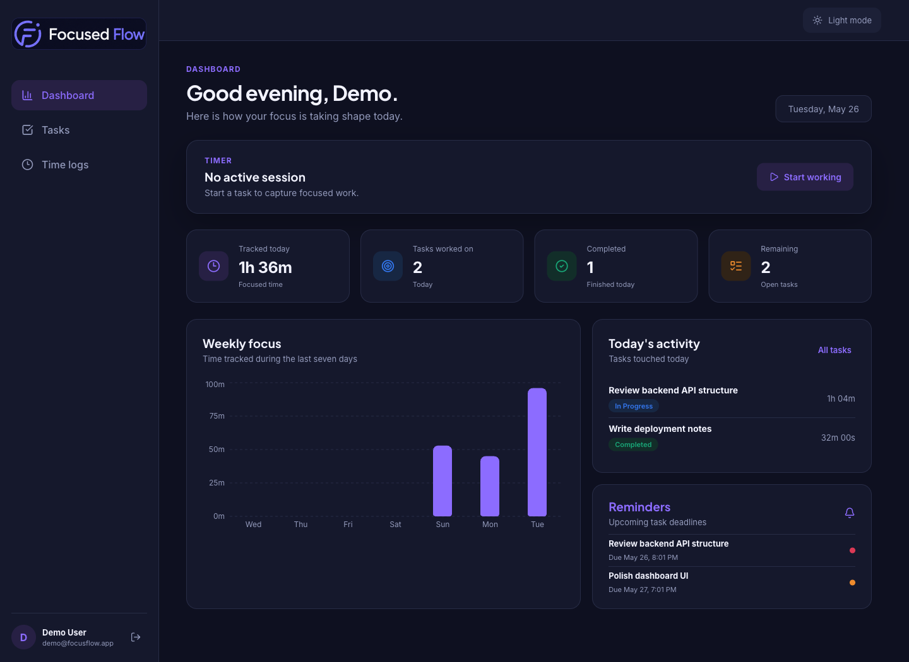
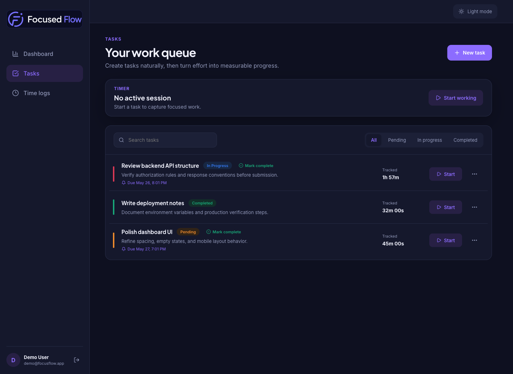
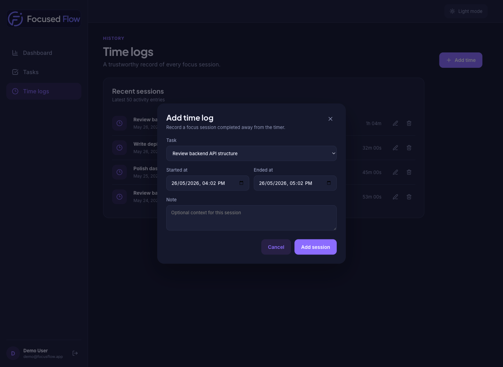

# Focused Flow

Focused Flow is a full-stack task and time tracking application built for focused individual productivity. Users can turn rough task ideas into structured work, track sessions in real time, and review daily and weekly progress in a polished dashboard.

## Submission Links

- Source repository: [github.com/Awowowow/FocusFlow](https://github.com/Awowowow/FocusFlow)
- Live application: [focus-flow-ten-navy.vercel.app](https://focus-flow-ten-navy.vercel.app/login)
- API health endpoint: [focus-flow-backend-chi.vercel.app/api/health](https://focus-flow-backend-chi.vercel.app/api/health)
- Demo account after local seeding: `demo@focusflow.app` / `Focusflow123`

## Features

- Secure sign up, login and logout using an HTTP-only JWT cookie and bcrypt password hashing
- Strict user ownership checks on every task, timer and analytics endpoint
- Task CRUD with statuses, priorities, full-text filtering and editable Gemini-assisted suggestions
- One-click task completion for fast workflow updates
- Exclusive real-time timer: only one active session per user, with refresh-safe elapsed display
- Time log history with manual create/edit/delete corrections and tracked totals per task
- Explicit Daily Summary view for tasks worked on, total tracked time, completed tasks and remaining work
- Weekly Summary productivity chart covering the last seven days
- Deadline reminders surfaced on the task board and dashboard
- Responsive light/dark dashboard UI with loading, error and empty states
- Structured validation, centralized error handling, request hardening and OpenAPI JSON documentation

## Backend Highlights

The API is designed around invariants rather than only happy-path CRUD:

- `TimeLog_one_active_per_user` is a partial unique PostgreSQL index that prevents two open timer sessions for one user.
- Timer starts execute inside a serializable Prisma transaction, so concurrent requests fail with a meaningful `409` response.
- Every resource lookup is scoped by authenticated `userId`; knowing another task ID does not grant access.
- Daily totals clip sessions at timezone-aware day boundaries, including sessions that cross midnight or are still active.
- The Gemini task suggestion endpoint has a deterministic local fallback, so task creation remains functional without an API key.

## Tech Stack

| Layer | Technology |
| --- | --- |
| Client | React, Vite, TanStack Query, React Router, Recharts |
| API | Node.js, Express, Zod |
| Authentication | JWT HTTP-only cookie, bcryptjs |
| Database | PostgreSQL, Prisma ORM |
| Security | Helmet, CORS, auth rate limiting |
| AI assistant | Gemini API with fallback mode |
| Tests | Vitest |

## Development Effort

Approximate time spent building this project: **6 hours**.

## Screenshots

### Dashboard: Daily Summary, Weekly Summary and reminders



### Task management: status filtering, deadlines and quick completion



### Time tracking: historical session CRUD



## Repository Structure

```text
focusflow/
  client/                 React dashboard application
  server/
    prisma/               Schema, migrations and demo seed
    src/
      controllers/        HTTP response orchestration
      middleware/         Auth, validation and error handling
      routes/             REST resource routing
      services/           Business rules and persistence logic
      utils/              Timezone/reporting and token helpers
  docker-compose.yml      Local PostgreSQL service
```

## Local Setup

### Prerequisites

- Node.js 20 or later
- Docker Desktop, or an existing PostgreSQL database

### 1. Install dependencies

```bash
npm run install:all
```

### 2. Configure environment

```bash
cp server/.env.example server/.env
cp client/.env.example client/.env
```

For local Docker usage, the provided `DATABASE_URL` already matches `docker-compose.yml` and exposes PostgreSQL on port `55433` to avoid collisions with other local projects. Replace `JWT_SECRET` before deployment.

### 3. Start PostgreSQL and prepare data

```bash
docker compose up -d postgres
npm run db:deploy --prefix server
npm run db:seed --prefix server
```

### 4. Run the applications

In separate terminals:

```bash
npm run dev:server
npm run dev:client
```

Open [http://localhost:5173](http://localhost:5173). You can create a new account or use the seeded demo account.

## API Overview

All endpoints below except authentication and health require the session cookie.

| Method | Endpoint | Description |
| --- | --- | --- |
| `GET` | `/api/health` | Deployment health check |
| `GET` | `/api/docs.json` | OpenAPI description |
| `POST` | `/api/auth/register` | Register and begin session |
| `POST` | `/api/auth/login` | Log in |
| `POST` | `/api/auth/logout` | Log out |
| `GET` | `/api/auth/me` | Get current account |
| `GET/POST` | `/api/tasks` | List or create owned tasks |
| `GET/PATCH/DELETE` | `/api/tasks/:taskId` | Manage one owned task |
| `POST` | `/api/tasks/suggest` | Suggest structured task fields |
| `POST` | `/api/tasks/:taskId/timer/start` | Start an exclusive timer |
| `POST` | `/api/tasks/:taskId/timer/stop` | Finish and persist a timer |
| `GET` | `/api/time/active` | Fetch the running timer |
| `GET/POST` | `/api/time/logs` | List history or create a completed manual log |
| `PATCH/DELETE` | `/api/time/logs/:logId` | Correct or delete an owned completed log |
| `GET` | `/api/summary/today` | Current-day analytics |
| `GET` | `/api/summary/weekly` | Seven-day time series |

## Verification

```bash
npm test --prefix server
npx prisma validate --schema server/prisma/schema.prisma
npm run lint --prefix client
npm run build --prefix client
```

## Deployment Plan

- Database: Neon PostgreSQL
- Backend: Vercel Express Function with `server` as the root directory
- Frontend: Vercel Vite application with `client` as the root directory

### Backend Deployment

Import this GitHub repository into Vercel as a project with:

```text
Root Directory: server
Framework Preset: Express (configured in `server/vercel.json`)
Build Command: npx prisma generate && npx prisma migrate deploy (configured in `server/vercel.json`)
Output Directory: do not override
Install Command: npm install (configured in `server/vercel.json`)
```

Production and Preview environment variables required on the API project:

```env
NODE_ENV=production
CLIENT_URL=https://frontend-domain.vercel.app
DATABASE_URL=neon-postgresql-url
JWT_SECRET=a-long-random-production-secret
JWT_EXPIRES_IN=7d
COOKIE_NAME=focusflow_token
GEMINI_API_KEY=google-ai-studio
GEMINI_MODEL=gemini-2.5-flash
```

### Frontend Deployment

Import this GitHub repository a second time into Vercel with:

```text
Root Directory: client
Framework Preset: Vite
Build Command: npm run build
Output Directory: dist
Install Command: npm install
```

After the backend has a production URL, configure the frontend API proxy to forward `/api` requests to that backend before deploying the frontend. This keeps session cookies on the frontend origin for reliable browser authentication.

Production and Preview environment variable after the proxy is configured:

```env
VITE_API_URL=/api
```

After both projects are deployed, update API `CLIENT_URL` to the production frontend URL and redeploy the API.

Before submission, replace the pending live links at the top of this file after production smoke testing.
